# Medical NER Project

An intelligent document processing pipeline for extracting structured information from medical documents using OCR, rule-based extraction, human-in-the-loop validation, and machine learning.

Developed as part of the course **CS F429 - Natural Language Processing** at BITS Pilani. (Lab 6 - Medical assignment)

## 🏥 Project Overview

This project automatically processes medical documents (PDFs, images) and extracts structured information such as:
- **Patient demographics** (name, age, ID, gender, phone)
- **Test results** with values, units, and reference ranges
- **Doctor information** and referring physicians
- **Dates, locations, and lab details**

The system combines rule-based pattern matching with machine learning to achieve high accuracy while continuously improving through human feedback.

## 🚀 Key Features

- **🖼️ Smart Image Preprocessing**: PDF-to-image conversion, automatic deskewing, noise reduction
- **👁️ Advanced OCR**: Tesseract-based text extraction with confidence scoring and positional data
- **🧠 Intelligent Extraction**: Sophisticated regex patterns with medical domain knowledge
- **👤 Human-in-the-Loop Interface**: Web-based validation and correction system
- **🤖 Machine Learning**: Sklearn-based token classification that learns from corrections
- **♻️ Hybrid Approach**: Combines ML and rule-based extraction for optimal results
- **🏗️ Modular Architecture**: Clean, maintainable, and extensible codebase

## 📁 Project Structure

```
medical-ner-project/
├── config/
│   └── settings.py              # Configuration settings
├── src/
│   ├── data_processing/
│   │   ├── image_preprocessor.py    # Image preprocessing functions
│   │   └── ocr_extractor.py         # OCR text extraction
│   ├── extraction/
│   │   ├── hybrid_extractor.py      # ML augmented extraction
│   │   ├── rule_based_extractor.py  # Rule-based information extraction
│   │   └── text_processor.py        # Text processing utilities
│   ├── interface/
│   │   └── hitl_interface.py        # Human-in-the-loop interface
│   ├── ml_models/
│   │   ├── model_trainer.py         # Model training orchestration
│   │   └── sklearn_classifier.py    # Sklearn-based classifier
│   └── utils/
│       └── helpers.py               # Utility functions
├── data/
│   ├── raw/                         # Raw input documents
│   ├── processed/                   # Processed data
│   └── sample/                      # Sample data
├── outputs/
│   ├── cleaned_images/              # Preprocessed images
│   ├── ocr_results/                 # OCR output files
│   ├── extraction_results/          # Extracted structured data
│   └── hitl_results/                # Human corrections and confirmations
├── models/
│   └── saved_models/                # Trained ML models
├── requirements.txt                 # Project dependencies
└── main.py                          # Main execution script
```

## 🛠️ Installation & Setup

### Prerequisites
- **Python 3.8+** (recommended: Python 3.11)
- **Tesseract OCR** engine
- **Git** (for cloning the repository)

### Step 1: Clone the Repository
```bash
git clone <repository-url>
cd medical-ner-project
```

### Step 2: Create Virtual Environment (Recommended)
```bash
# Using conda
conda create -n medical-ner python=3.11
conda activate medical-ner

# OR using venv
python -m venv medical-ner-env
source medical-ner-env/bin/activate  # Linux/Mac
# medical-ner-env\Scripts\activate   # Windows
```

### Step 3: Install Python Dependencies
```bash
pip install -r requirements.txt
```

### Step 4: Install Tesseract OCR

**Ubuntu/Debian:**
```bash
sudo apt-get update
sudo apt-get install tesseract-ocr
```

**macOS:**
```bash
brew install tesseract
```

**Windows:**
1. Download from [UB Mannheim Tesseract](https://github.com/UB-Mannheim/tesseract/wiki)
2. Install and add to PATH
3. Verify with: `tesseract --version`

### Step 5: Verify Installation
```bash
python -c "import pytesseract; print('Tesseract available:', pytesseract.get_tesseract_version())"
```

## 🚀 Quick Start

### Option 1: Run Complete Pipeline (Recommended)
```bash
python main.py
```
This will prompt you through each step:
1. Image preprocessing
2. OCR extraction  
3. Information extraction (with hybrid ML+rules if model exists)
4. Launch human validation interface

### Option 2: Step-by-Step Execution

#### 1. Prepare Your Data
Place your medical PDF files in the `data/raw/` directory:
```
data/raw/
├── medical_report_1.pdf
├── lab_results_2.pdf
└── patient_report_3.pdf
```

#### 2. Run Image Preprocessing
```python
from src.data_processing.image_preprocessor import preprocess_directory

# Process all PDFs in data/raw/
processed_images = preprocess_directory(
    'data/raw/', 
    output_dir='outputs/cleaned_images',
    dpi=300
)
```

#### 3. Extract Text with OCR
```python
from src.data_processing.ocr_extractor import extract_text

# Extract text from preprocessed images
ocr_results = extract_text(
    processed_images, 
    output_dir='outputs/ocr_results'
)
```

#### 4. Extract Medical Information
```python
from src.extraction.rule_based_extractor import rule_based_extraction
from src.extraction.hybrid_extractor import hybrid_extraction

# Use rule-based extraction
extraction_results = rule_based_extraction(ocr_results)

# OR use hybrid extraction (if ML model exists)
extraction_results = hybrid_extraction(ocr_results)
```

#### 5. Launch Human Validation Interface
```python
from src.interface.hitl_interface import start_working_hitl_review

# Start web-based validation interface
hitl = start_working_hitl_review(extraction_results, ocr_results)
# Open http://localhost:5000 in your browser
```

#### 6. Train ML Model (After Collecting Corrections)
```python
from src.ml_models.model_trainer import train_sklearn_model

# Train model using human corrections
model_path = train_sklearn_model()
```

## 📊 Output Structure & Results

The system generates structured outputs at each stage:

### 📁 Directory Structure After Processing
```
outputs/
├── cleaned_images/           # Preprocessed images ready for OCR
│   ├── cleaned_image_1.png
│   └── cleaned_image_2.png
├── ocr_results/             # Raw OCR output with positions
│   ├── tokens_page_1.json   # Detailed token data
│   ├── tokens_page_1.csv    # Human-readable format
│   └── all_tokens.json      # Combined results
├── extraction_results/      # Structured medical data
│   ├── extracted_page_01.json
│   └── all_extractions.json
└── hitl_results/           # Human validation data
    ├── corrections/        # User corrections for training
    └── confirmed/         # Validated final results
```

### 📋 Sample Extraction Output
```json
{
  "page": 1,
  "patient_info": {
    "name": "Mr. K P SHRAVAN",
    "age": "40",
    "gender": "Male",
    "patient_id": "6186848",
    "phone": "9035707662"
  },
  "test_results": [
    {
      "test_name": "Adjusted Calcium",
      "value": "8.1",
      "unit": "mg/dL",
      "confidence": 96.2,
      "line_number": 15
    },
    {
      "test_name": "Chloride", 
      "value": "109",
      "unit": "mEq/L",
      "confidence": 94.8,
      "line_number": 17
    }
  ],
  "confidence_scores": {
    "name": 90.5,
    "age": 96.0,
    "gender": 95.0
  }
}
```

## 🎯 Usage Examples

### Processing Medical Lab Reports
```bash
# 1. Place your PDFs in data/raw/
cp ~/medical_reports/*.pdf data/raw/

# 2. Run the complete pipeline
python main.py

# 3. Follow the prompts:
#    - "Run image preprocessing step? [Y/n]:" → Y
#    - "Run OCR extraction step? [Y/n]:" → Y  
#    - "Run rule-based extraction step? [Y/n]:" → Y
#    - "Use hybrid extraction (ML + rules)? [Y/n]:" → Y (if model exists)

# 4. Open the validation interface at http://localhost:8050 (port address might be different for you)
```

### Training Your Own Model
```bash
# 1. Process documents and validate through HITL interface
python main.py

# 2. After making corrections in the web interface, train a model
python -c "from src.ml_models.model_trainer import train_sklearn_model; train_sklearn_model()"

# 3. Future runs will automatically use the trained model
```

### Custom Extraction Patterns
```python
# Edit src/extraction/rule_based_extractor.py to add new patterns
patterns = {
    'custom_field': [
        r'custom\s*pattern\s*:\s*(.+)',
        r'another\s*variation\s*(.+)'
    ]
}
```

## 🔧 Configuration & Customization

### Key Configuration Files

**`config/settings.py`** - Main configuration:
```python
# OCR Settings
TESSERACT_CONFIG = '--oem 3 --psm 6'
OCR_CONFIDENCE_THRESHOLD = 50

# Image Processing
DEFAULT_DPI = 300
DENOISE_STRENGTH = 10

# Extraction Settings  
MIN_CONFIDENCE_SCORE = 60
```

### Customizing Extraction Patterns

Edit `src/extraction/rule_based_extractor.py`:
```python
# Add new medical field patterns
patterns = {
    'lab_id': [
        r'(?:lab\s*id|labid)\s*[:\s]*([A-Z0-9]{8,})',
    ],
    'doctor': [
        r'(?:dr\.?\s*|doctor\s*)([a-zA-Z][a-zA-Z\s\.]+)',
    ]
}
```

### Performance Tuning

**For better OCR accuracy:**
- Increase DPI: `dpi=400` in preprocessing
- Adjust Tesseract PSM: `--psm 4` for single column text
- Fine-tune denoising parameters

**For faster processing:**
- Lower DPI: `dpi=200` for speed vs. accuracy tradeoff
- Skip validation: Run with `run_extraction=False` in main.py
- Batch processing: Process multiple files at once

## 🚦 Pipeline Workflow

```mermaid
graph TD
    A[📄 Raw PDFs] --> B[🖼️ Image Preprocessing]
    B --> C[👁️ OCR Text Extraction]
    C --> D[🧠 Rule-Based Extraction]
    D --> E[🤖 ML Enhancement]
    E --> F[👤 Human Validation]
    F --> G[💾 Save Corrections]
    G --> H[🎓 Train Model]
    H --> I[♻️ Improved Extraction]
    I --> E
```



1. **PDF Processing**: Convert medical PDFs to clean, OCR-ready images
2. **Text Extraction**: Extract text with positional and confidence data
3. **Information Extraction**: Apply regex patterns and ML models
4. **Human Validation**: Web interface for reviewing and correcting results
5. **Model Training**: Learn from human corrections to improve accuracy
6. **Continuous Improvement**: Each iteration makes the system smarter

## 🏆 Performance & Accuracy

### Typical Results
- **OCR Accuracy**: 90-95% on clean medical documents
- **Extraction Recall**: 85-92% for patient information
- **Extraction Precision**: 93-97% with validation
- **Processing Speed**: ~30 seconds per page (including OCR)

### Accuracy Factors
- **Document quality**: Clear scans perform better than low-resolution images
- **Template consistency**: Standardized lab formats have higher accuracy
- **Human feedback**: System improves significantly with corrections

## � Troubleshooting

### Common Issues & Solutions

**❌ "Tesseract not found" Error**
```bash
# Check if Tesseract is installed
tesseract --version

# If not found, install:
# Ubuntu: sudo apt-get install tesseract-ocr
# macOS: brew install tesseract
# Windows: Download from UB Mannheim Tesseract
```

**❌ Low OCR Accuracy**
- Check image quality and resolution (recommended 300+ DPI)
- Verify documents are properly oriented (not rotated)
- Try adjusting preprocessing parameters in `config/settings.py`

**❌ Import Errors**
```bash
# Reinstall dependencies
pip install -r requirements.txt --force-reinstall

# Check Python version
python --version  # Should be 3.8+
```

**❌ Poor Extraction Results**
- Review and adjust regex patterns in `rule_based_extractor.py`
- Collect more human corrections to train better ML models
- Check confidence thresholds in configuration

## 🤝 Potential Improvements

### Adding New Medical Fields
1. **Update extraction patterns** in `src/extraction/rule_based_extractor.py`
2. **Add validation rules** for the new field type
3. **Update HITL interface** to display the new field
4. **Test with sample documents**

### Improving OCR Accuracy
1. **Experiment with preprocessing** parameters in `image_preprocessor.py`
2. **Try different Tesseract PSM modes** for your document types
3. **Add custom image filters** for specific document characteristics

### Enhancing ML Models
1. **Collect more training data** through the HITL interface
2. **Experiment with different feature sets** in `sklearn_classifier.py`
3. **Try alternative ML algorithms** (Random Forest, SVM, etc.)


